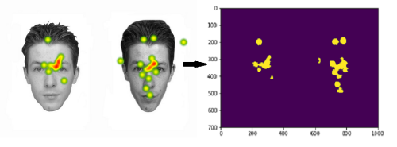

# README

This code was developed to transform eye-strategy heatmap images (provided by an eye-tracker) into a .csv file.

### How it works:

The first step consist into getting an image (with Heatmap) and subtract the original one (without heatmap). Later it will binarize the image to avoid noise. (You can adjust the threshold to reduce even more noise.)

This example shows an eye-strategy from the Glasgow Face Matching Test [(Burton et.al, (2010))](scr/Journals/Burton2010_Article_TheGlasgowFaceMatchingTest.pdf)

The results from this repository can be found [here](scr/Journals/Varelaetal2018.pdf)
